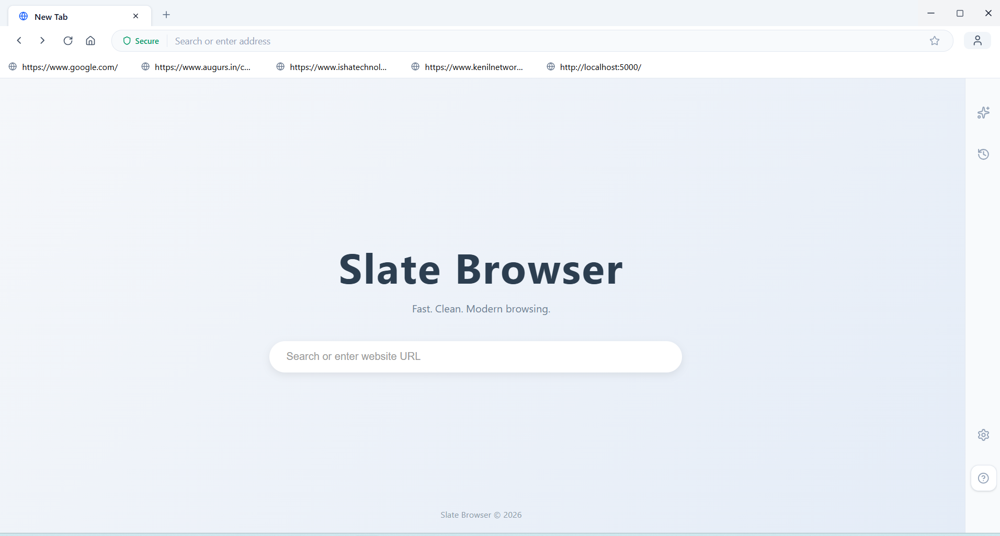
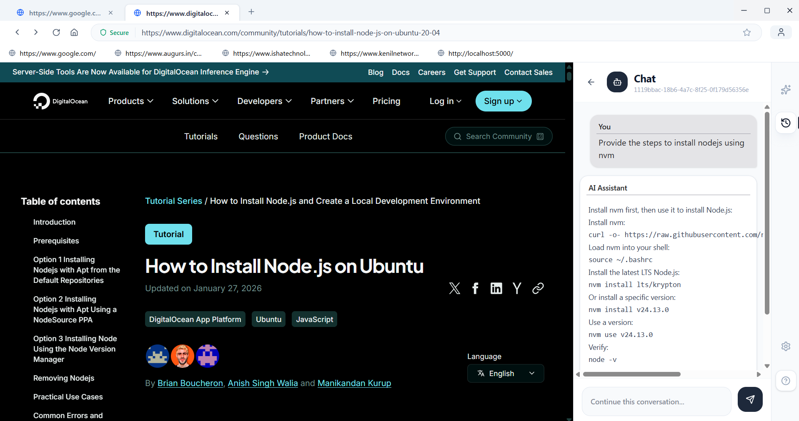

# SlateBrowser

SlateBrowser is a desktop browser application with a built-in AI chat experience.

## Screenshots

### Home


### AI Chat


## Getting Started (Windows)

Follow these steps to set up the development environment on Windows.

### 1. Open a terminal at the project root

Open `cmd` (or PowerShell) in the root directory of this project.

### 2. Install dependencies

```bash
npm install
```

### 3. Run the dev environment

```bash
npm run dev
```

## Troubleshooting

### Native module version mismatch (`better-sqlite3`)

If you encounter the following error when starting the app:

```
A JavaScript error occurred in the main process
```

with an underlying cause similar to:

```
better-sqlite3 was compiled for NODE_MODULE_VERSION 137 but this Electron build requires 146
```

This means `better-sqlite3` needs to be rebuilt for the correct Electron ABI version. Fix it by running:

```bash
npm run run-after-better-sqlite3-install
```

Then start the dev environment again:

```bash
npm run dev
```

## License

_Add license information here._
